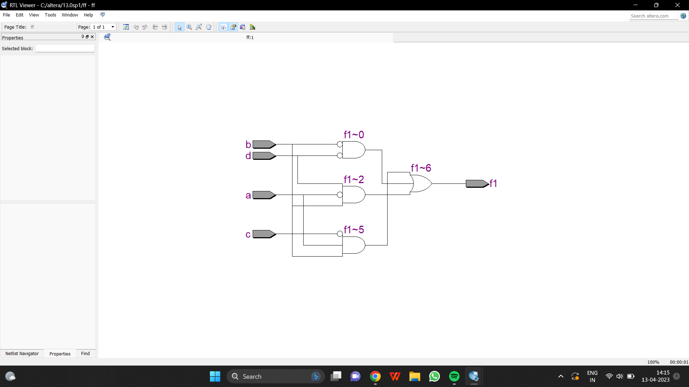
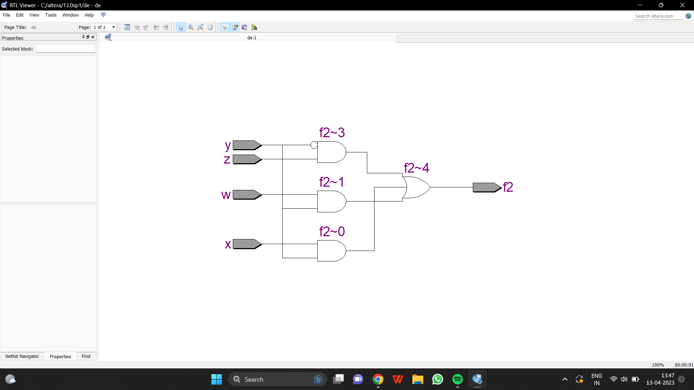
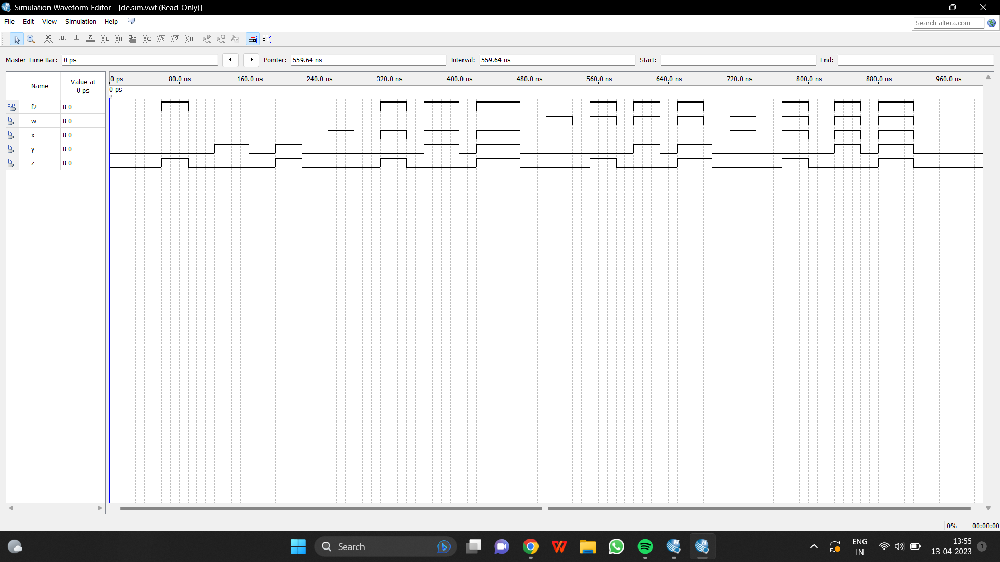

# Experiment--02-Implementation-of-combinational-logic
Implementation of combinational logic gates
 
## AIM:
To implement the given logic function verify its operation in Quartus using Verilog programming.
 F1= A’B’C’D’+AC’D’+B’CD’+A’BCD+BC’D
F2=xy’z+x’y’z+w’xy+wx’y+wxy  
F2=xy’z+x’y’z+w’xy+wx’y+wxy  
## Equipments Required:
## Hardware – PCs, Cyclone II , USB flasher
## Software – Quartus prime
## Theory
Logic gates are electronic circuits which perform logical functions on one or more inputs to produce one output.

## Logic Diagram

Using NOR gates NOR gate is actually a combination of two logic gates: OR gate followed by NOT gate. So its output is complement of the output of an OR gate. This gate can have minimum two inputs, output is always one. By using only NOR gates, we can realize all logic functions: AND, OR, NOT, Ex-OR, Ex-NOR, NAND. So this gate is also called universal gate. Designing a circuit with NOR gates only uses the same basic techniques as designing a circuit with NAND gates; that is, the application of deMorgan’s theorem. The only difference between NOR gate design and NAND gate design is that the former must eliminate product terms and the later must eliminate sum terms.

F=(((C.B'.A)+(D.C'.A)+(C.B'.A))')'

## Procedure

The input and output variables are allocated with letter symbols. The exact truth table that defines the required relationships between 
inputs and outputs is derived. The simplified Boolean function is obtained from each output. The logic diagram is drawn.

## Program:
/*
Program to implement the given logic function and to verify its operations in quartus using Verilog programming.

module ff(a,b,c,d,f1);
input a,b,c,d;
output f1;
assign f1 = (~b&~d) | (~a&b&d) | (a&b&~c);
endmodule

module de (w,x,y,z,f2);
input w,x,y,z;
output f2;
assign f2 = (x&y)|(w&y)|(~y&z);
endmodule

Developed by:G.PAVANA 
RegisterNumber: 212222230105 
*/

## Output:
## RTL

## Timing Diagram

## Result:
Thus the given logic functions are implemented using  and their operations are verified using Verilog programming.
